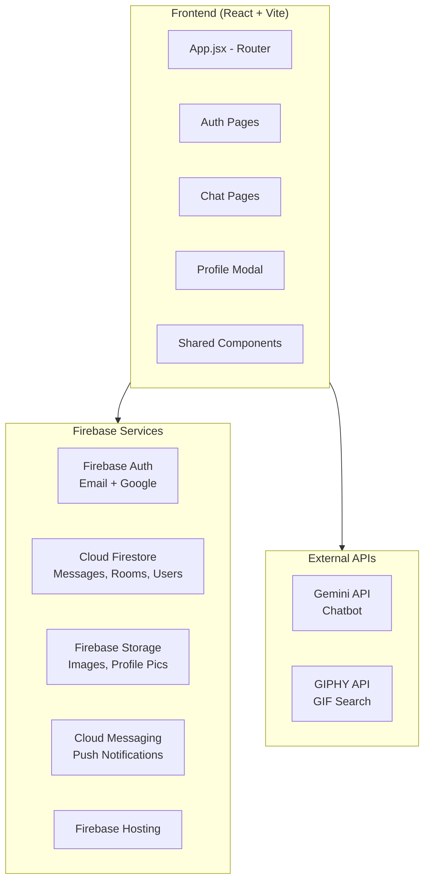

# Chatroom Midterm Project — 完整實作計畫書

> **課程**: CS2410 Software Studio 軟體設計與實驗  
> **學號**: 113062330  
> **截止日期**: 2026/05/07 23:59  
> **部署平台**: Firebase Hosting  
> **技術棧**: React (Vite) + Firebase (Auth, Firestore, Storage, Cloud Messaging)

---

## 目標總覽與配分

| 類別 | 項目 | 分數 |
|------|------|------|
| **Basic** | Membership (Email 註冊/登入) | 5% |
| **Basic** | Firebase Hosting | 5% |
| **Basic** | Database read/write (authenticated) | 5% |
| **Basic** | RWD 響應式設計 | 5% |
| **Basic** | Git 版控 | 5% |
| **Basic** | Chatroom (建立、訊息、歷史、邀請) | 25% |
| **Advanced** | React 框架 | 5% |
| **Advanced** | Google 第三方登入 | 1% |
| **Advanced** | Chrome Notification (未讀訊息) | 5% |
| **Advanced** | CSS Animation | 2% |
| **Advanced** | XSS 防護 (code injection) | 2% |
| **Advanced** | User Profile (頭像、姓名、信箱、電話、地址) | 10% |
| **Advanced** | Message Operation (收回、編輯、搜尋、圖片) | 10% |
| **Bonus** | Chatbot (Gemini API) | 2% |
| **Bonus** | Block User | 2% |
| **Bonus** | Send GIF (GIPHY API) | 3% |
| **Bonus** | Message Emoji (表情反應) | 3% |
| **Completeness** | 整體完成度 (主觀) | 10% |
| | **總計** | **105%** |

---

## 技術架構



---

## Firebase 資料庫結構 (Firestore Schema)

```
firestore/
├── users/                          # 使用者資料集合
│   └── {userId}/                   # Document ID = Firebase Auth UID
│       ├── uid: string
│       ├── email: string
│       ├── username: string
│       ├── photoURL: string        # 頭像下載連結 (Firebase Storage)
│       ├── phone: string
│       ├── address: string
│       ├── blockedUsers: string[]  # 被此使用者封鎖的 UID 列表
│       ├── createdAt: timestamp
│       └── updatedAt: timestamp
│
├── chatrooms/                      # 聊天室集合
│   └── {chatroomId}/
│       ├── name: string            # 聊天室名稱
│       ├── type: "private" | "group"
│       ├── members: string[]       # 成員 UID 列表
│       ├── createdBy: string       # 建立者 UID
│       ├── createdAt: timestamp
│       ├── lastMessage: string     # 最後一則訊息預覽
│       ├── lastMessageAt: timestamp
│       │
│       └── messages/               # 子集合：訊息
│           └── {messageId}/
│               ├── senderId: string
│               ├── senderName: string
│               ├── senderPhoto: string
│               ├── type: "text" | "image" | "gif" | "sticker" | "system"
│               ├── content: string           # 文字內容或圖片 URL
│               ├── isEdited: boolean
│               ├── isUnsent: boolean         # 收回標記
│               ├── replyTo: {                # 回覆引用 (bonus, 本次不做)
│               │     messageId: string,
│               │     content: string,
│               │     senderName: string
│               │   } | null
│               ├── emojis: map               # { [emoji]: [userId1, userId2, ...] }
│               ├── createdAt: timestamp
│               └── updatedAt: timestamp
│
└── notifications/                  # 通知記錄 (for Chrome Notification)
    └── {notificationId}/
        ├── targetUserId: string
        ├── chatroomId: string
        ├── senderId: string
        ├── senderName: string
        ├── content: string
        ├── isRead: boolean
        └── createdAt: timestamp
```

---

## 專案檔案結構

```
chatroom/
├── public/
│   ├── firebase-messaging-sw.js    # Service Worker for FCM
│   └── vite.svg
│
├── src/
│   ├── main.jsx                    # React 進入點
│   ├── App.jsx                     # 路由設定 (React Router)
│   ├── App.css                     # 全域樣式
│   ├── index.css                   # CSS Reset & Variables
│   │
│   ├── config/
│   │   └── firebase.js             # Firebase 初始化 & 匯出
│   │
│   ├── contexts/
│   │   └── AuthContext.jsx         # Auth 狀態管理 (Context + Provider)
│   │
│   ├── hooks/
│   │   ├── useAuth.js              # Auth 相關 hook
│   │   ├── useChatrooms.js         # 聊天室列表 hook
│   │   ├── useMessages.js          # 訊息即時監聽 hook
│   │   ├── useNotification.js      # Chrome 通知 hook
│   │   └── useUserProfile.js       # 使用者資料 hook
│   │
│   ├── pages/
│   │   ├── LoginPage.jsx           # 登入頁面
│   │   ├── RegisterPage.jsx        # 註冊頁面
│   │   └── ChatPage.jsx            # 主聊天頁面 (含側邊欄 + 聊天區)
│   │
│   ├── components/
│   │   ├── common/
│   │   │   ├── LoadingSpinner.jsx  # 載入動畫
│   │   │   ├── Avatar.jsx          # 頭像元件
│   │   │   └── Modal.jsx           # 通用 Modal
│   │   │
│   │   ├── auth/
│   │   │   ├── LoginForm.jsx       # 登入表單
│   │   │   ├── RegisterForm.jsx    # 註冊表單
│   │   │   └── GoogleLoginBtn.jsx  # Google 登入按鈕
│   │   │
│   │   ├── sidebar/
│   │   │   ├── Sidebar.jsx         # 側邊欄容器
│   │   │   ├── ChatroomList.jsx    # 聊天室列表
│   │   │   ├── ChatroomItem.jsx    # 單一聊天室項目
│   │   │   ├── CreateRoomModal.jsx # 建立聊天室 Modal
│   │   │   └── InviteMemberModal.jsx # 邀請成員 Modal
│   │   │
│   │   ├── chat/
│   │   │   ├── ChatArea.jsx        # 聊天區域容器
│   │   │   ├── ChatHeader.jsx      # 聊天室標頭 (名稱、成員、搜尋)
│   │   │   ├── MessageList.jsx     # 訊息列表 (虛擬滾動)
│   │   │   ├── MessageBubble.jsx   # 單一訊息氣泡
│   │   │   ├── MessageInput.jsx    # 訊息輸入列 (含圖片、GIF、emoji)
│   │   │   ├── MessageSearch.jsx   # 訊息搜尋元件
│   │   │   ├── EmojiReaction.jsx   # 訊息表情反應
│   │   │   ├── ImagePreview.jsx    # 圖片預覽 Modal
│   │   │   └── GifPicker.jsx       # GIF 選擇器 (GIPHY API)
│   │   │
│   │   ├── profile/
│   │   │   └── ProfileModal.jsx    # 使用者個人資料 Modal
│   │   │
│   │   └── chatbot/
│   │       └── ChatbotModal.jsx    # Chatbot 對話 Modal (Gemini API)
│   │
│   ├── services/
│   │   ├── authService.js          # Auth 相關 API (register, login, google)
│   │   ├── chatroomService.js      # 聊天室 CRUD
│   │   ├── messageService.js       # 訊息 CRUD (send, edit, unsend, search)
│   │   ├── userService.js          # 使用者資料 CRUD
│   │   ├── storageService.js       # Firebase Storage 上傳/下載
│   │   ├── notificationService.js  # FCM 通知服務
│   │   ├── geminiService.js        # Gemini API 呼叫
│   │   ├── giphyService.js         # GIPHY GIF API 呼叫
│   │
│   └── utils/
│       ├── sanitize.js             # XSS 防護 (HTML escape)
│       ├── formatTime.js           # 時間格式化
│       └── constants.js            # 常數定義 (emoji 列表等)
│
├── .env                            # 環境變數 (API keys) — 不上傳 Git
├── .env.example                    # 環境變數範例
├── .gitignore
├── .firebaserc                     # Firebase 專案設定
├── firebase.json                   # Firebase Hosting 設定
├── index.html                      # Vite 入口
├── package.json
├── vite.config.js
└── README.md                       # 使用說明 & 本地架設步驟
```

---

## 分階段實作步驟

### Phase 0: 專案初始化

#### Step 0.1 — 建立 Vite + React 專案
```bash
cd c:\Users\pkboi\OneDrive\文件\大學\大二下\軟體設計與實驗\chatroom
npx -y create-vite@latest ./ -- --template react
npm install
```

#### Step 0.2 — 安裝依賴
```bash
npm install firebase react-router-dom dompurify
npm install -D @types/dompurify
```

> [!IMPORTANT]
> **不需要安裝其他 UI 框架**，所有樣式用 Vanilla CSS 手寫，以滿足 CSS animation 加分項。

#### Step 0.3 — Git 初始化
```bash
git init
git add .
git commit -m "chore: initial project setup with Vite + React"
```

> [!TIP]
> **Git 要求**: 需要定期 commit，不能只在最後一天提交。每完成一個 Phase 都要 commit。

#### Step 0.4 — Firebase 專案設定
1. 前往 [Firebase Console](https://console.firebase.google.com/) 建立新專案
2. 啟用以下服務：
   - **Authentication**: 啟用 Email/Password 和 Google 登入提供者
   - **Cloud Firestore**: 建立資料庫 (以測試模式開始，之後再寫 Rules)
   - **Cloud Storage**: 啟用 (用於圖片、頭像上傳)
   - **Cloud Messaging**: 啟用 (Chrome Push Notification)
   - **Hosting**: 啟用
3. 在專案設定中取得 Firebase config，寫入 `.env`:

```env
VITE_FIREBASE_API_KEY=your_api_key
VITE_FIREBASE_AUTH_DOMAIN=your_project.firebaseapp.com
VITE_FIREBASE_PROJECT_ID=your_project_id
VITE_FIREBASE_STORAGE_BUCKET=your_project.appspot.com
VITE_FIREBASE_MESSAGING_SENDER_ID=your_sender_id
VITE_FIREBASE_APP_ID=your_app_id
VITE_FIREBASE_VAPID_KEY=your_vapid_key
VITE_GEMINI_API_KEY=your_gemini_api_key
VITE_GIPHY_API_KEY=your_giphy_api_key
```

#### Step 0.5 — 建立 `src/config/firebase.js`
```javascript
import { initializeApp } from 'firebase/app';
import { getAuth, GoogleAuthProvider } from 'firebase/auth';
import { getFirestore } from 'firebase/firestore';
import { getStorage } from 'firebase/storage';
import { getMessaging } from 'firebase/messaging';

const firebaseConfig = {
  apiKey: import.meta.env.VITE_FIREBASE_API_KEY,
  authDomain: import.meta.env.VITE_FIREBASE_AUTH_DOMAIN,
  projectId: import.meta.env.VITE_FIREBASE_PROJECT_ID,
  storageBucket: import.meta.env.VITE_FIREBASE_STORAGE_BUCKET,
  messagingSenderId: import.meta.env.VITE_FIREBASE_MESSAGING_SENDER_ID,
  appId: import.meta.env.VITE_FIREBASE_APP_ID,
};

const app = initializeApp(firebaseConfig);

export const auth = getAuth(app);
export const googleProvider = new GoogleAuthProvider();
export const db = getFirestore(app);
export const storage = getStorage(app);
export const messaging = getMessaging(app);
export default app;
```

**Git commit**: `feat: configure Firebase services`

---

### Phase 1: 會員系統 (Membership — 5% + Google 1%)

#### Step 1.1 — AuthContext
建立 `src/contexts/AuthContext.jsx`:
- 使用 `createContext` + `useContext` 管理全域 auth 狀態
- 用 `onAuthStateChanged` 監聽使用者登入/登出
- 提供 `currentUser`, `loading` 狀態

#### Step 1.2 — Auth Services
建立 `src/services/authService.js`:
- `registerWithEmail(email, password, username)` — 使用 `createUserWithEmailAndPassword`，並在 Firestore `users` 集合中建立使用者文件
- `loginWithEmail(email, password)` — 使用 `signInWithEmailAndPassword`
- `loginWithGoogle()` — 使用 `signInWithPopup(auth, googleProvider)`，首次登入時自動在 Firestore 建立使用者文件
- `logout()` — 使用 `signOut`

#### Step 1.3 — 登入/註冊頁面
建立 `src/pages/LoginPage.jsx` 和 `src/pages/RegisterPage.jsx`:
- 表單驗證 (email 格式、密碼長度)
- 錯誤訊息顯示
- 登入/註冊成功後導向 ChatPage
- Google 登入按鈕

#### Step 1.4 — 路由保護
在 `App.jsx` 設定 React Router:
- `/login` → LoginPage
- `/register` → RegisterPage
- `/` → ChatPage (需登入，否則導向 /login)
- 使用 `PrivateRoute` 元件保護需登入的路由

**Git commit**: `feat: implement authentication system with Email and Google login`

---

### Phase 2: 聊天室核心 (Chatroom — 25%)

#### Step 2.1 — Chatroom Service
建立 `src/services/chatroomService.js`:
- `createChatroom(name, type, memberIds)` — 建立聊天室文件
- `getChatrooms(userId)` — 查詢使用者所屬的聊天室（使用 `where('members', 'array-contains', userId)`）
- `inviteMembers(chatroomId, newMemberIds)` — 更新 members 陣列 (使用 `arrayUnion`)
- `subscribeToChatrooms(userId, callback)` — 即時監聽聊天室列表變化

#### Step 2.2 — Message Service
建立 `src/services/messageService.js`:
- `sendMessage(chatroomId, messageData)` — 寫入訊息到子集合，同時更新聊天室的 `lastMessage` 和 `lastMessageAt`
- `subscribeToMessages(chatroomId, callback)` — 使用 `onSnapshot` 即時監聽訊息（按 `createdAt` 排序）
- `editMessage(chatroomId, messageId, newContent)` — 更新訊息內容，設定 `isEdited: true`
- `unsendMessage(chatroomId, messageId)` — 設定 `isUnsent: true`（不實際刪除，顯示「訊息已收回」）
- `searchMessages(chatroomId, query)` — 本地搜尋（載入所有訊息後在前端 filter）

#### Step 2.3 — 側邊欄 UI
建立 Sidebar 相關元件:
- `Sidebar.jsx` — 頂部有使用者頭像/名稱、「建立聊天室」按鈕、搜尋欄
- `ChatroomList.jsx` — 渲染聊天室列表，顯示最後訊息預覽
- `ChatroomItem.jsx` — 單一聊天室：名稱、最後訊息、時間
- `CreateRoomModal.jsx` — 選擇聊天對象、輸入群組名稱
- `InviteMemberModal.jsx` — 搜尋並邀請新成員

#### Step 2.4 — 聊天區域 UI
建立 Chat 相關元件:
- `ChatArea.jsx` — 聊天區容器（header + messages + input）
- `ChatHeader.jsx` — 顯示聊天室名稱、成員數、邀請按鈕、搜尋按鈕
- `MessageList.jsx` — 訊息列表，自動滾動到最新訊息
- `MessageBubble.jsx` — 訊息氣泡（區分自己/他人），支援：
  - 右鍵選單或長按選單：收回、編輯（僅限自己的訊息）
  - 顯示「已編輯」標記
  - 已收回的訊息顯示為「此訊息已被收回」
  - 顯示發送者頭像、名稱、時間
- `MessageInput.jsx` — 輸入欄 with 附加功能按鈕列（圖片、GIF、emoji）

#### Step 2.5 — 即時通訊邏輯
在 `useMessages.js` hook 中：
- 使用 `onSnapshot` 訂閱當前聊天室的 messages 子集合
- 自動排序、去重
- 處理新訊息到來時自動滾動

**Git commit**: `feat: implement core chatroom with real-time messaging`

---

### Phase 3: 使用者個人資料 (User Profile — 10%)

#### Step 3.1 — User Service
建立 `src/services/userService.js`:
- `getUserProfile(userId)` — 讀取使用者資料
- `updateUserProfile(userId, data)` — 更新使用者資料
- `getAllUsers()` — 取得所有使用者（用於邀請成員時搜尋）
- `searchUsers(query)` — 搜尋使用者

#### Step 3.2 — Storage Service
建立 `src/services/storageService.js`:
- `uploadProfileImage(userId, file)` — 上傳頭像到 `profile_images/{userId}`
- `uploadMessageImage(chatroomId, file)` — 上傳訊息圖片到 `message_images/{chatroomId}/{filename}`
- 回傳下載 URL

#### Step 3.3 — ProfileModal 元件
建立 `src/components/profile/ProfileModal.jsx`:
- 顯示/編輯以下欄位：
  - Profile picture（點擊可上傳新圖片，preview 後儲存）
  - Username
  - Email（唯讀，來自 Auth）
  - Phone number
  - Address
- 儲存按鈕：呼叫 `updateUserProfile`
- 在聊天區域的 MessageBubble 中顯示發送者的 username 和 profile picture

**Git commit**: `feat: implement user profile with image upload`

---

### Phase 4: 訊息操作 (Message Operation — 10%)

#### Step 4.1 — 收回訊息 (Unsend)
- 在 MessageBubble 上，僅對自己的訊息顯示「收回」選項
- 點擊後呼叫 `unsendMessage`，設定 `isUnsent: true`
- 已收回的訊息在 UI 上顯示為灰色斜體「此訊息已被收回」
- 圖片訊息也可以收回

#### Step 4.2 — 編輯訊息 (Edit)
- 在 MessageBubble 上，僅對自己的**文字**訊息顯示「編輯」選項
- 點擊後將訊息內容填入 MessageInput，切換為編輯模式
- 編輯完成後呼叫 `editMessage`
- 顯示「已編輯」標記

#### Step 4.3 — 搜尋訊息 (Search)
- ChatHeader 上的搜尋按鈕打開 `MessageSearch.jsx`
- 輸入關鍵字後，在當前聊天室的所有訊息中搜尋（前端 filter）
- 點擊搜尋結果可跳轉到該訊息位置並高亮

#### Step 4.4 — 傳送圖片 (Send Image)
- MessageInput 中的圖片按鈕，觸發 file input
- 選擇圖片後，先 preview 再上傳到 Firebase Storage
- 上傳完成後發送 `type: "image"` 的訊息，content 為下載 URL
- MessageBubble 中渲染圖片，點擊可放大預覽 (ImagePreview modal)
- 圖片訊息也支援收回

**Git commit**: `feat: implement message operations (unsend, edit, search, send image)`

---

### Phase 5: Advanced Components

#### Step 5.1 — Chrome Notification (5%)
1. 建立 `public/firebase-messaging-sw.js`:
   ```javascript
   importScripts('https://www.gstatic.com/firebasejs/10.x.x/firebase-app-compat.js');
   importScripts('https://www.gstatic.com/firebasejs/10.x.x/firebase-messaging-compat.js');
   // 初始化 Firebase & 處理 background message
   ```
2. `src/services/notificationService.js`:
   - `requestNotificationPermission()` — 請求瀏覽器通知權限
   - `getToken()` — 取得 FCM token 並儲存到 Firestore
   - 監聽前景訊息 `onMessage`
3. `src/hooks/useNotification.js`:
   - 在 ChatPage 載入時請求通知權限
   - **只通知未讀訊息**（使用者不在當前聊天室時才通知）
   - 追蹤使用者當前所在的聊天室 ID

> [!IMPORTANT]
> **Chrome Notification 的關鍵要求**：只通知「未讀」訊息，不是所有訊息都通知。
> 實作方式：當使用者不在某聊天室時，該聊天室的新訊息應觸發通知。
> 可以用 Firestore `onSnapshot` 在前端判斷，並使用 `Notification API` 直接發本地通知（不需要 FCM server）。
> 更簡單的做法：直接用瀏覽器的 `Notification API` 搭配 Firestore 即時監聽，不需要完整的 FCM 後端。

#### Step 5.2 — CSS Animation (2%)
在以下地方加入 CSS 動畫（不能只是 hover effect）：
- **頁面載入動畫**: 訊息列表淡入 (fade-in + slide-up)
- **新訊息動畫**: 新訊息從底部滑入
- **Modal 動畫**: 開啟/關閉時有 scale + fade 效果
- **打字指示器動畫**: 三個跳動的圓點 (bouncing dots)
- **側邊欄摺疊動畫**: 在手機版中側邊欄滑出/滑入

使用 `@keyframes` 定義動畫，例如：
```css
@keyframes slideInUp {
  from { transform: translateY(20px); opacity: 0; }
  to { transform: translateY(0); opacity: 1; }
}

@keyframes bouncing {
  0%, 80%, 100% { transform: scale(0); }
  40% { transform: scale(1); }
}
```

#### Step 5.3 — XSS 防護 (2%)
- 安裝 `dompurify`
- 建立 `src/utils/sanitize.js`：
  ```javascript
  import DOMPurify from 'dompurify';
  export const sanitizeInput = (input) => DOMPurify.sanitize(input, { ALLOWED_TAGS: [] });
  ```
- **所有使用者輸入**在顯示前都經過 sanitize
- 特別處理：
  - `<script>alert('example');</script>` → 顯示為純文字
  - `<h1>example</h1>` → 顯示為純文字
- 在 MessageBubble 中使用 `textContent` 或 React 的 JSX 自動 escape 來渲染文字

**Git commit**: `feat: implement Chrome notification, CSS animations, and XSS protection`

---

### Phase 6: Bonus Components

#### Step 6.1 — Chatbot with Gemini API (2%)
建立 `src/services/geminiService.js`:
```javascript
const GEMINI_API_KEY = import.meta.env.VITE_GEMINI_API_KEY;
const API_URL = `https://generativelanguage.googleapis.com/v1beta/models/gemini-2.0-flash:generateContent?key=${GEMINI_API_KEY}`;

export async function chatWithGemini(message, history = []) {
  const response = await fetch(API_URL, {
    method: 'POST',
    headers: { 'Content-Type': 'application/json' },
    body: JSON.stringify({
      contents: [...history, { role: 'user', parts: [{ text: message }] }]
    })
  });
  const data = await response.json();
  return data.candidates[0].content.parts[0].text;
}
```

建立 `src/components/chatbot/ChatbotModal.jsx`:
- 獨立的 chatbot 對話 Modal（不是聊天室內的機器人）
- 支援多輪對話 (維護 history)
- 可從側邊欄的按鈕開啟
- UI 仿 ChatGPT 風格

#### Step 6.2 — Block User (2%)
在 `src/services/userService.js` 新增：
- `blockUser(currentUserId, targetUserId)` — 將 targetUserId 加入 blockedUsers 陣列
- `unblockUser(currentUserId, targetUserId)` — 移除
- `getBlockedUsers(userId)` — 取得封鎖名單

邏輯：
- **私聊**：When User A blocks User B:
  - User B 無法發送私訊給 User A
  - 如果有聊天記錄，聊天 UI 顯示警告通知「你已無法與此用戶聊天」
- **群聊**：When A (blocker) and B (blocked) in same group:
  - A 看不到 B 的訊息，B 看不到 A 的訊息（互相隱藏）
- 在 MessageBubble 中檢查 `blockedUsers` 列表，條件隱藏訊息
- 在使用者 Profile 或聊天室成員列表中提供「封鎖/解除封鎖」按鈕

#### Step 6.3 — Send GIF from GIPHY API (3%)

> [!NOTE]
> Tenor API 自 2026/01 起停止接受新用戶，改用 GIPHY API。
> 需顯示 "Powered by GIPHY" attribution。
> 申請方式：前往 https://developers.giphy.com/ 註冊帳號 → Dashboard → Create an App → 取得 API Key。
> Beta key 免費，限制 100 req/hr，足夠本專案使用。

建立 `src/services/giphyService.js`:
```javascript
const GIPHY_API_KEY = import.meta.env.VITE_GIPHY_API_KEY;
const BASE_URL = 'https://api.giphy.com/v1/gifs';

export async function searchGifs(query, limit = 20, offset = 0) {
  const res = await fetch(
    `${BASE_URL}/search?api_key=${GIPHY_API_KEY}&q=${encodeURIComponent(query)}&limit=${limit}&offset=${offset}&rating=g&lang=en`
  );
  const data = await res.json();
  return data.data; // array of gif objects, each has .images.fixed_height.url
}

export async function getTrendingGifs(limit = 20, offset = 0) {
  const res = await fetch(
    `${BASE_URL}/trending?api_key=${GIPHY_API_KEY}&limit=${limit}&offset=${offset}&rating=g`
  );
  const data = await res.json();
  return data.data;
}
```

建立 `src/components/chat/GifPicker.jsx`:
- 搜尋欄 + GIF 網格（使用 CSS Grid，2~3 欄瀑布流）
- 預設顯示 trending GIFs
- 點擊 GIF 後發送 `type: "gif"` 的訊息，content 存 GIF URL
- 從 MessageInput 的 GIF 按鈕開啟
- **底部顯示 "Powered by GIPHY" logo**（GIPHY 使用條款要求）
- GIF 渲染使用 `gif.images.fixed_height.url` 作為顯示源

#### Step 6.4 — Message Emoji Reactions (3%)
建立 `src/components/chat/EmojiReaction.jsx`:
- 預定義 emoji 列表（例如：👍❤️😂😮😢😡🔥👏）
- 在 MessageBubble 懸停或長按時顯示 emoji 選擇列
- 選擇 emoji 後更新 Firestore 的 emojis map:
  ```
  emojis: { "👍": ["uid1", "uid2"], "❤️": ["uid3"] }
  ```
- 在訊息氣泡下方顯示 emoji 反應（emoji + 數量）
- 再次點擊同一 emoji 可以取消（unsend emoji）
- 多人對同一訊息送 emoji 時，顯示 emoji 和回應人數

**Git commit**: `feat: implement bonus components (chatbot, block user, GIF, emoji reactions)`

---

### Phase 7: RWD 響應式設計 (5%)

#### 設計斷點
```css
/* Mobile first approach */
:root {
  --sidebar-width: 320px;
}

/* Tablet */
@media (max-width: 768px) {
  /* 側邊欄改為 overlay 模式 */
  /* 漢堡選單按鈕 */
}

/* Mobile */
@media (max-width: 480px) {
  /* 全螢幕聊天 */
  /* 側邊欄佔滿寬度 */
}
```

#### RWD 要求
- **所有元件都必須可見**，不能有元件因為螢幕大小而消失
- **不需要滾動**就能看到主要功能（滾動會扣分）
- Mobile 版：側邊欄為 overlay，開啟時覆蓋聊天區
- Tablet 版：側邊欄變窄，只顯示頭像
- Desktop 版：完整側邊欄 + 聊天區

**Git commit**: `feat: implement responsive design for all screen sizes`

---

### Phase 8: UI 設計系統與樣式

#### 設計風格：深色 Messenger 風格
```css
:root {
  /* Color Palette - Dark Theme */
  --bg-primary: #1a1a2e;
  --bg-secondary: #16213e;
  --bg-tertiary: #0f3460;
  --bg-chat: #1a1a2e;

  --text-primary: #e8e8e8;
  --text-secondary: #a0a0b0;
  --text-muted: #6c6c7e;

  --accent-primary: #6c63ff;      /* 主色 - 紫色 */
  --accent-secondary: #e94560;    /* 次色 - 紅色 */
  --accent-gradient: linear-gradient(135deg, #6c63ff, #e94560);

  --bubble-self: #6c63ff;         /* 自己的訊息 */
  --bubble-other: #2a2a4a;        /* 他人的訊息 */

  --border-color: rgba(255, 255, 255, 0.08);
  --hover-color: rgba(255, 255, 255, 0.05);

  --shadow-sm: 0 2px 8px rgba(0, 0, 0, 0.3);
  --shadow-md: 0 4px 16px rgba(0, 0, 0, 0.4);
  --shadow-lg: 0 8px 32px rgba(0, 0, 0, 0.5);

  --radius-sm: 8px;
  --radius-md: 12px;
  --radius-lg: 20px;
  --radius-full: 50%;

  --transition-fast: 0.15s ease;
  --transition-normal: 0.3s ease;
  --transition-slow: 0.5s ease;

  /* Typography */
  --font-family: 'Inter', -apple-system, BlinkMacSystemFont, sans-serif;
}
```

#### 引入 Google Font
在 `index.html` 的 `<head>` 中：
```html
<link href="https://fonts.googleapis.com/css2?family=Inter:wght@300;400;500;600;700&display=swap" rel="stylesheet">
```

**Git commit**: `style: implement design system and polish UI`

---

### Phase 9: 部署與交付

#### Step 9.1 — Firebase Hosting 部署
```bash
npm install -g firebase-tools
firebase login
firebase init hosting
# 選擇 dist 作為 public directory
# 設定為 SPA (single-page app): Yes
# 不覆蓋 index.html

npm run build
firebase deploy
```

`firebase.json` 設定：
```json
{
  "hosting": {
    "public": "dist",
    "ignore": ["firebase.json", "**/.*", "**/node_modules/**"],
    "rewrites": [
      { "source": "**", "destination": "/index.html" }
    ]
  }
}
```

#### Step 9.2 — Firestore Security Rules
```
rules_version = '2';
service cloud.firestore {
  match /databases/{database}/documents {
    // 使用者只能讀寫自己的資料
    match /users/{userId} {
      allow read: if request.auth != null;
      allow write: if request.auth != null && request.auth.uid == userId;
    }

    // 聊天室：成員才能讀寫
    match /chatrooms/{chatroomId} {
      allow read: if request.auth != null && request.auth.uid in resource.data.members;
      allow create: if request.auth != null;
      allow update: if request.auth != null && request.auth.uid in resource.data.members;

      match /messages/{messageId} {
        allow read: if request.auth != null;
        allow create: if request.auth != null;
        allow update: if request.auth != null && request.auth.uid == resource.data.senderId;
      }
    }
  }
}
```

#### Step 9.3 — README.md
README 必須包含：
1. **網站功能說明** — 列出所有已實作的功能
2. **操作方式** — 如何使用每個功能（含截圖）
3. **本地架設步驟 (STEP BY STEP)**:
   ```
   1. git clone <repo-url>
   2. cd chatroom
   3. npm install
   4. 建立 .env 檔案（參考 .env.example）
   5. npm run dev
   6. 開啟 http://localhost:5173
   ```
4. **使用技術** — React, Firebase, Gemini API, GIPHY API

#### Step 9.4 — 打包與 MD5
```bash
# Build
npm run build

# 壓縮 (排除 node_modules)
# 在 Windows PowerShell:
Compress-Archive -Path .\* -DestinationPath ..\Midterm_Project_113062330.zip -Force
# 注意要排除 node_modules

# MD5
Get-FileHash ..\Midterm_Project_113062330.zip -Algorithm MD5
```

**Git commit**: `chore: prepare for deployment and submission`

---

## Firestore 索引需求

需要在 Firebase Console 或 `firestore.indexes.json` 中建立以下複合索引：

| Collection | Fields | Order |
|------------|--------|-------|
| `chatrooms` | `members` (Array), `lastMessageAt` (Desc) | — |
| `chatrooms/{id}/messages` | `createdAt` (Asc) | — |

---

## 環境變數清單 (.env.example)

```env
# Firebase
VITE_FIREBASE_API_KEY=
VITE_FIREBASE_AUTH_DOMAIN=
VITE_FIREBASE_PROJECT_ID=
VITE_FIREBASE_STORAGE_BUCKET=
VITE_FIREBASE_MESSAGING_SENDER_ID=
VITE_FIREBASE_APP_ID=
VITE_FIREBASE_VAPID_KEY=

# Gemini API
VITE_GEMINI_API_KEY=

# GIPHY API
VITE_GIPHY_API_KEY=
```

---

## Git Commit 策略

按照以下順序，每個 Phase 至少一個 commit：

| 順序 | Commit Message | 對應 Phase |
|------|---------------|-----------|
| 1 | `chore: initial project setup with Vite + React` | Phase 0 |
| 2 | `feat: configure Firebase services` | Phase 0 |
| 3 | `feat: implement authentication (Email + Google)` | Phase 1 |
| 4 | `feat: implement core chatroom with real-time messaging` | Phase 2 |
| 5 | `feat: implement user profile with image upload` | Phase 3 |
| 6 | `feat: implement message operations` | Phase 4 |
| 7 | `feat: implement Chrome notification` | Phase 5 |
| 8 | `feat: add CSS animations and XSS protection` | Phase 5 |
| 9 | `feat: implement chatbot with Gemini API` | Phase 6 |
| 10 | `feat: implement block user feature` | Phase 6 |
| 11 | `feat: implement GIF picker with GIPHY API` | Phase 6 |
| 12 | `feat: implement emoji reactions` | Phase 6 |
| 13 | `feat: implement responsive design` | Phase 7 |
| 14 | `style: implement design system and polish UI` | Phase 8 |
| 15 | `chore: prepare for deployment` | Phase 9 |

> [!WARNING]
> Git 評分要求「定期 commit」，不能只在最後一天。建議在實作過程中頻繁 commit，每個小功能完成就 commit 一次。

---

## 驗證計畫

### 自動化驗證
1. `npm run build` — 確認 production build 成功
2. `firebase deploy` — 確認部署成功
3. 在 Chrome 中測試所有功能

### 手動驗證清單
- [ ] Email 註冊/登入
- [ ] Google 登入
- [ ] 建立私聊/群聊
- [ ] 發送/收到即時訊息
- [ ] 載入歷史訊息
- [ ] 邀請新成員加入聊天室
- [ ] 編輯個人資料（頭像、名稱、信箱、電話、地址）
- [ ] 收回訊息（文字+圖片）
- [ ] 編輯訊息
- [ ] 搜尋訊息
- [ ] 傳送圖片
- [ ] Chrome 通知（僅未讀訊息）
- [ ] CSS 動畫效果
- [ ] XSS 防護（輸入 `<script>` 標籤）
- [ ] Chatbot 對話
- [ ] 封鎖使用者（私聊+群聊）
- [ ] 傳送 GIF
- [ ] 訊息 Emoji 反應
- [ ] RWD（桌面、平板、手機）
- [ ] Firebase Hosting 正常運作

---

## 注意事項

> [!CAUTION]
> 1. **不要上傳 `node_modules`** 到 zip 檔案中（扣 5 分）
> 2. **不要忘記 README.md**（扣 5 分）
> 3. **不要忘記依照 SOP 繳交**（扣 10 分）
> 4. **MD5 checksum 必須做**（扣 10%）
> 5. **主頁面必須叫 `index.html`**
> 6. `.env` 檔案不要上傳到 Git（加入 .gitignore）
